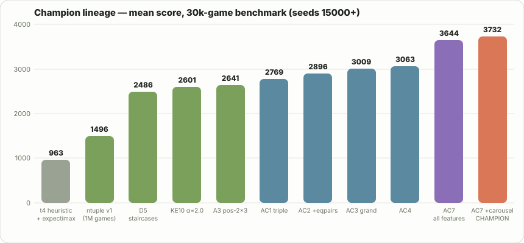
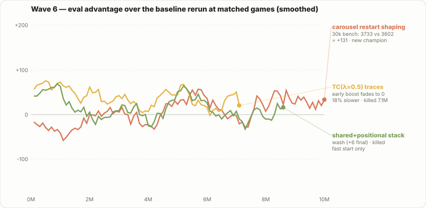

# integer_snake

Engine, heuristics, and tree-search solvers for **123 Snake (Integer Snake)** — the
2016 mobile number-chain puzzle. The playable web recreation lives in
[`123-snake.html`](123-snake.html); this crate is the simulation/solver backend.

## Game rules

- 5×5 grid of numbered tiles; fresh tiles are uniform random 1, 2, or 3.
- A move traces a self-avoiding orthogonal path through tiles that all share one
  value (length ≥ 2). The path collapses into its **sum on the final cell**; every
  vacated cell refills **in place** with a fresh 1/2/3.
- Score is the cumulative sum of merged tiles. The game ends when no two
  orthogonally adjacent tiles are equal.

The RNG is **mulberry32, bit-compatible with the web build** (verified against a JS
reference vector in tests), so a `(seed, move sequence)` pair replays identically in
Rust and in the browser. Refill draws happen in path order, matching the web build.

## Action space (solver semantics)

- **Stop actions included**: a chain may end anywhere, so every prefix (length ≥ 2)
  of a longer chain is its own action — equivalent to re-clicking the current
  square to stop. Move generation emits moves at every DFS node, never only
  maximal chains.
- **Coalescing**: actions are deduplicated by `(cell-set, head)`. Different drag
  orders over the same cells into the same head are one action. This is
  distribution-exact: refills are i.i.d. uniform per vacated cell, so the traced
  order only matters for bit-exact RNG replay (where the stored representative
  path is applied).
- **No undo / no untoggle**: undo and mid-drag deselection are UI affordances,
  not game actions; every reachable final chain is enumerated directly.

Both properties are locked in by regression tests (`stop_actions_are_included`,
`coalescing_merges_equivalent_chains`).

## Layout

| Module | Contents |
|---|---|
| `game` | `Board`, `Move`, mulberry32, move generation (deduped by cell-set + head), apply/refill |
| `heuristics` | Tile classification (`Small` 1-3 / `Smooth` 2^a·3^b / `Pow2` ≥4 / `Off` prime>3), tunable `Weights` presets v1–v6, value function |
| `search` | `Policy` trait, `RandomPolicy`, `ExpectimaxPolicy` (depth-limited, sampled chance nodes, top-k pruning; never peeks at the game RNG) |
| `eval` | Seeded multi-threaded EV scorer with mean/stderr, survival, max-tile, bad-tile diagnostics |

## CLI

```sh
cargo build --release
./target/release/snake eval --n 500 --cap 300 --seed0 5000 \
    --policies "random,greedy:v1,exp:d2:s12:k16:v3"
./target/release/snake play --policy exp:d2:s6:k12:v5 --seed 42 --cap 20
```

Policy specs: `random`, `greedy:<weights>`, `exp:d<depth>:s<samples>:k<topk>:<weights>`
with weights `score | v1 | v1lin | v2 | v3 | v4 | v5 | v6`.

## Experiment results — the heuristic era (500 fresh episodes, move cap 300, seeds 5000+)

*(This section chronicles the hand-crafted-heuristic phase. It was
superseded by the learned n-tuple networks below, which beat the best
heuristic champion by ~4x.)*

| policy | mean score | ±se | mean moves | mean max tile |
|---|---|---|---|---|
| random | 91.7 | 1.6 | 16.8 | 13.1 |
| greedy:v1 | 285.5 | 5.8 | 34.5 | 29.7 |
| exp:d2:s3:k8:v1 | 337.9 | 7.1 | 36.2 | 37.2 |
| exp:d2:s12:k16:v3 | 525.1 | 12.4 | 55.6 | 48.0 |
| exp:d2:s12:k16:v5 | 551.9 | 12.6 | 55.1 | 51.2 |
| exp:d2:s12:k16:v3t4 | 603.8 | 14.7 | 60.4 | 55.8 |
| exp:d2:s12:k16:v5t | 667.4 | 17.6 | 62.3 | 60.3 |
| exp:d2:s12:k16:v5t4 | **680.6** | 18.1 | 62.4 | 61.4 |

Findings so far:

1. **Survival is the bottleneck.** Every policy dies naturally (100% before the
   move cap); score per move is similar (~8–10) across policies, so EV is driven by
   how long you stay alive. Heavy optionality + death-penalty weights (v3) beat the
   original priors (v1) by ~45%.
2. **The user priors work.** Penalizing powers of two ≥ 4 and any tile with a prime
   factor > 3, and rewarding 2^a·3^b tiles, triples random's EV even at depth 1.
3. **Width beats depth.** Depth-2 expectimax with 12 refill samples and top-16 moves
   (~495) beats depth-3 at every sampling budget tried (~330–405). Chance-node noise
   compounds with depth; sampling the chance layer well matters more than looking
   further ahead.
4. **Diminishing-returns optionality (v5, sqrt of pair count) matches v3** within
   noise at large budgets and wins at small budgets.
5. **Vanilla MCTS loses to expectimax at equal compute (for now).** Single-player
   UCT with double progressive widening, proxy priors, and value-function leaves
   (`mcts:n<sims>:c<uct>:<weights>`) reaches 590 ± 15 at ~20s/500 episodes
   (n=600, c=0.7) and 651 ± 17 at 6× compute (n=2000), vs expectimax's 681 ± 18 at
   13.8s. Hypotheses: at horizon ~2 the exhaustive-root + wide-sampling structure of
   expectimax is near-optimal; per-node prior computation (one proxy eval per action)
   dominates MCTS sim cost; and the uncalibrated, optionality-dominated value
   function gives deep search little signal to exploit. Revisit after value-function
   calibration (fit V to actual remaining score).
6. **Feature expansion + tournament tuning (t1, current champion: 844 ± 23 on
   fresh seeds vs 688 for v5t4).** Single-feature attribution on top of v5t4
   (400 episodes, reduced budget): big-tile centrality penalty **+72** (the
   standout — big tiles belong on the border); pair-quality and graded danger
   neutral; move-richness, isolated-2s, fragmentation, and spawn-economy *hurt*
   at guessed magnitudes. `snake tune` (mutation tournament, common random
   numbers, w_score fixed at 1.0 as the unit anchor) then found t1: softened
   class penalties (three 3.3, pow2 3.6), badpair credit 0.79, small iso2/
   center_bad/frag terms, moves and danger at zero. Note t1's extra features
   double eval cost (~60s vs ~30s per 500 episodes at d2/s12/k16).
7. **Round-2 tuning (t2, current champion: 871.7 ± 22.8 fresh seeds; t1 was
   843.6).** The 18-parameter tournament reactivated features the single-point
   sweeps had dismissed (iso2 1.44, moves 0.29, danger 0.34, n1 1.09) — feature
   interactions defeat one-at-a-time attribution. t2 also natively fixes the
   2×2-square misoptimization (its top-ranked moves on a crafted 2×2 board are
   all pair-merges; see tests/behavior.rs). New zero-default features available
   for future calibration: w_vpair (pending-merge potential), w_coal
   (same-corner coalescing; neutral at 0.3, negative above), and w_achv
   (immediately-achievable value under stone refills — pessimistic pair-tree
   bound per component). The achv sweep was uniformly negative (765→613 as
   weight rises 0.15→0.8): rewarding held potential encourages hoarding, which
   raises max tiles but shortens games. A joint 21-parameter retune with
   achv/vpair/coal seeded nonzero confirmed it: the tuner shrank achv 0.30→0.20
   and coal 0.20→0.09, and its champion (766 ± 19 full budget) stayed ~100
   points below t2 — the negative result survives letting every other weight
   adjust. Revisit under calibrated values, where potential gets discounted by
   realization probability instead of a fixed weight.
8. **Geometry features (t3, t4).** Quadrant coalescing — reward the best corner
   2x2 block's sum of big-tile size tiers (w_quad 2.0) — was worth +81 alone
   (t3, 890 full budget). The staircase reward — an x tile adjacent to its 2x
   tile for x >= 6, scaled by log2(x) (w_stair 0.5) — added +73 on top
   (t4, 962.7 ± 25.7, current champion). Both were user-suggested. Negative at
   hand magnitudes: long-chain penalties, pairwise gather, stranded/twin terms,
   positional class table stacked on quad, and forced "dominance" move rewrites
   (the strict-dominance argument fails on final-tile position; see the revert).
9. **The 2^k·3 whitelist is the strongest single heuristic found so far.** Splitting
   the old "smooth" class — rewarding only exactly-one-factor-of-3 tiles (6, 12, 24,
   48, ...) and penalizing three-heavy tiles (3^b with b ≥ 2: 9, 18, 27, 36, ...) —
   lifts depth-2 EV from 552 (v5) to 681 (v5t4), +23%. Behaviorally the solver now
   avoids merging exactly three 3s (→ 9) in favor of two (→ 6) or four (→ 12).
   Current champion: `exp:d2:s12:k16:v5t4`.

## The n-tuple era

Afterstate TD(0) with temporal-coherence learning rates over
dihedral-symmetric tuple lookup tables — the
[2048 lineage](https://arxiv.org/abs/1604.05085) adapted to 5x5 chains,
with a PENDING symbol so V(afterstate) embeds the refill expectation
(greedy play is effectively 1.5-ply). The champion stacks positional
4/5/6-tuples (rows, 2x2, plus, staircases, big-L, 2x3, run-4+2,
t321 triangles, fish), shared tiny tuples, and value-aware global
features (top-3 blob/path decompositions) into **1.09B parameters**,
trained 10M self-play games in ~14h via lock-free hogwild threads.



Selected findings (all verdicts = 30k-game benchmarks, seeds 15000+,
SEM ~17; run-to-run training variance is ±40-50 — n=1000 benchmarks
repeatedly gave wrong orderings for <80-point effects):

- **Exact chance-node enumeration** when 3^vacated <= samples (else
  without-replacement sampling) made depth-2 search +21% stronger AND
  5.5x faster — sampling noise was costing ~20%.
- **Best single features**: run42 (4-run + adjacent 2-run) +263,
  path4 +210, path3 +183, fish +180, blob3 +162, positional-2x3 +101.
  Value-aware global features win; value-blind ones are null. Combos
  keep scaling past 5M games; single features plateau.
- **Exact folding**: absorbed shapes (staircase+bigL -> t321,
  plus+2x2 -> fish, tiny -> rows/fish) fold orbit-to-orbit into their
  supersets at inference, |dV| < 1e-4 — 344 images removed for free.
- **Carousel restart shaping** (snapshot boards at max-tile 192/768,
  restart 25% of games from snapshots): **+131 over an
  identical-config rerun — the current champion at 3733**. Late-game
  states are undertrained by natural play; oversampling them is the
  only training-method intervention that survived.
- Negatives, for the record: TC(lambda)=0.5 accelerates early learning
  but converges to baseline while running 18% slower; shared+positional
  table stacking is a wash (+6); refill-consistency projection HURTS
  (-128) because PENDING cells are observables, not unknowns; OTD
  bonuses, baked optimism, staged promotion, and adaptive-depth search
  all finished at or below baseline.



## Test-time compute

Depth-2 expectimax over the folded champion, top-k moves x s sampled
refills per chance node (n=500 paired seeds, full cartesian in
`results/ttc/`):

| config | mean | ms/move |
|---|---|---|
| greedy | 3535 | 0.14 |
| 4x9 | 4386 | 2.5 |
| 4x27 | 4812 | 3.0 |
| **4x48** | **4877** | 3.2 |

Everything wider or deeper is dominated: beams past ~4 re-admit
noise-inflated moves (winner's curse on sampled chance nodes), and
depth 3+ pays quadratically for noisier leaves. Beam-of-4 is globally
optimal on a strong value function.

## Distilling into a CNN (ml/)

`ml/train_q2.py` distills full-width depth-2 teacher search into a
1.2M-param CNN (14-plane board embedding, 8 residual blocks, factored
pick-start-then-directions policy + value head, Apple MPS):

- Trie-value targets (every mid-chain state valued at the max over its
  completions' teacher Q) + deeper policy heads: **value corr 0.96,
  top-1 move agreement 0.51**.
- Data scaling works: 10x teacher states (118k -> 1.12M) doubled
  net-only play from 768 to **1685 mean** — vs the teacher's 3535 and
  a 5MB weight file against the table's 13GB.
- **Search amplifies value error** (`results/nn-ttc-puct.md`):
  value-greedy over the net collapses to 230; root-PUCT at 32 sims
  gains +15% but 128+ sims inverts and hunts the value head's
  off-manifold optimism. The fix is coverage (DAgger — machinery
  built and validated: `--dump-q`, `--label-q`, student-state
  dumping), not compute.

## Ranked leaderboard (server/)

The deployed game at [123snake.com](https://123snake.com) runs a
server-authoritative ranked mode: a Cloudflare Durable Object per game
holds the real board via the same wasm engine the lab embeds, clients
submit chain paths only, and daily/monthly/all-time boards live in D1
(Pacific-midnight boundaries, best-effort profanity filtering via
obscenity + belts, per-score immutable entries). See
[`server/README.md`](server/README.md) for the API and deploy story.

## Next steps

- DAgger round 1 for the CNN: student rollouts + teacher labels are
  generated; retrain and re-test PUCT on the robust value head.
- Unfinished wave-7 arms: hook6/zig6 corner-turn 6-tuples,
  chain-12-alphabet 7-tuples (corner L44, stair7), hashed corner
  8-tuple — implemented and seeded, verdicts pending compute.
- Leaderboard Labs: lookahead refill queue, 1v1 over WebSockets on the
  game Durable Object (shared stream, per-move clock), merge-value
  garbage injection.
- Value calibration of the heuristic-era ideas under the learned V
  (potential-term negatives may flip with realization-probability
  discounting).

## Files and build

Sources (edit these):

- `123-snake.html` — the game UI (pure JS, no undo, share button); published
  verbatim as the artifact and wrapped into the Pages site by the build.
- `solver/lab-src.html` — the solver lab UI (wasm placeholder; the weights
  table is rendered from JSON the engine emits, so it can never drift).
- `src/` — the Rust engine, heuristics, search, eval harness, and wasm ABI.

Generated (run `python3 build.py` after changing the engine or a source page):

- `solver/solver-lab.html` — lab with the compiled wasm engine embedded.
- `docs/index.html` — the GitHub Pages site (game in a full HTML document).

CI (`.github/workflows/ci.yml`) runs fmt, clippy `-D warnings`, tests, and the
wasm build on every push.
